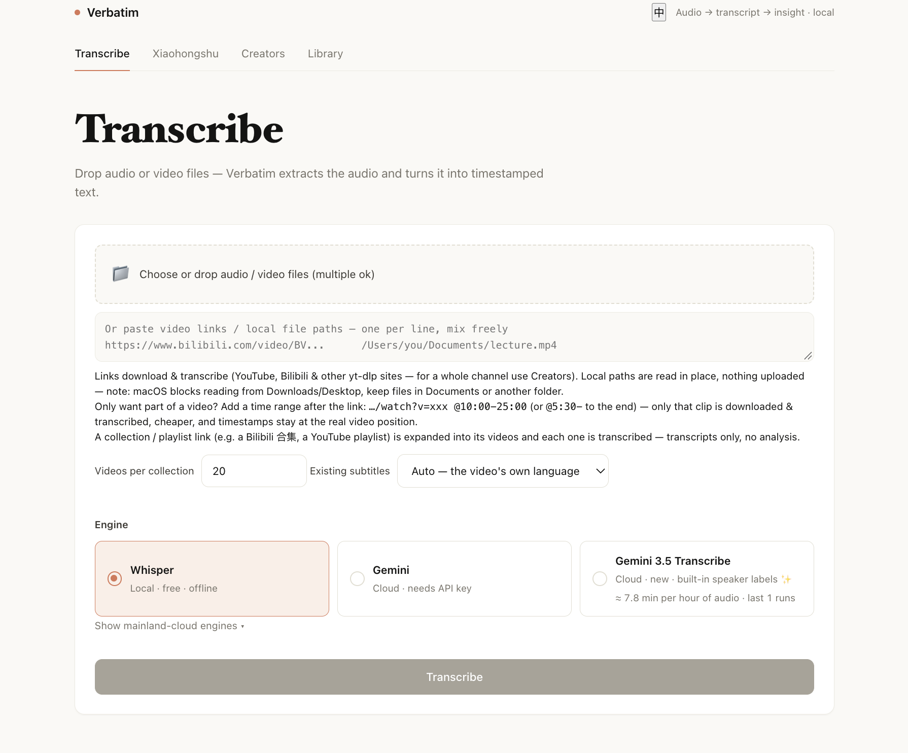

# Verbatim

**Free, local, unlimited-length transcription. Paste a YouTube/Bilibili link, get a transcript with timestamps. No account needed.**

Built by Kapozux/Kerwin, student in Shanghai. In active development since March 2026.



## What it does

Paste a link and Verbatim downloads the video, transcribes it, and writes a timestamped summary. Paste a
whole channel or playlist instead, and it pulls every episode, transcribes each one, extracts evidence
cards from every episode, and builds a portrait of the creator from those cards. If a cloud engine fails
on a file, that file falls back to local Whisper automatically. It works with YouTube, Bilibili, and
local audio/video files.

## Why I built it

I can't sit through an hour-long video, but I still want to know what was said. Existing tools were
either expensive or bad at Chinese, so I built my own. I've used it daily for six months and put 790+
hours of audio through it.

## Quick Start

```bash
brew install ffmpeg yt-dlp
git clone https://github.com/Kapozux/_Verbatim_.git && cd _Verbatim_/getAudio
pip install -r requirements.txt
bash run.sh        # open http://localhost:5001
```

Python 3.9+. Use Homebrew's `yt-dlp`, not the pip package.

## Engines

| Engine | Good for |
|---|---|
| Whisper | Local and free (GPU-accelerated on Apple Silicon) |
| Gemini | Mixed Chinese/English |
| Gemini 3.5 | Tells speakers apart |
| QwenASR | Strong on Chinese |
| Precise | Hybrid: Gemini text + Alibaba speaker diarization |

Local Whisper transcription needs no API key. Summaries and creator analysis use Gemini; add keys in
Settings or in `getAudio/.env`:

```ini
GEMINI_API_KEY=...        # Gemini engines, summaries, analysis
DASHSCOPE_API_KEY=...     # QwenASR / Precise
OPENROUTER_API_KEY=...    # optional: Claude as the analysis model
```

## Evidence Cards

Every sentence in a creator analysis traces back to a specific timestamp in the original video. 33,832
evidence cards generated so far.

## MCP Server

```bash
pipx install verbatim-transcribe-mcp
```

Claude Code and other agents can call Verbatim directly: transcribe links, search transcripts, run
creator analysis.

## Stats

| Lines of code | Commits | Transcripts | Hours transcribed | Evidence cards |
|---|---|---|---|---|
| ~16,000 | 100+ | 2,058 | 795 | 33,832 |

## Known Issues

- **Creator pipelines don't auto-resume** after a server restart. They're marked failed; click
  **Continue** to reuse everything already done and redo only what's missing.
- **`--cookies-from-browser`** requires the named browser to be installed locally.
- Gemini may block sensitive material; that file falls back to local Whisper instead of failing.
- The **Xiaohongshu tab** needs a companion scraper project (`XHS_PROJECT` env var) and `uv`. It's not a
  pip dependency, since it drives a real logged-in browser session.
- **Not built yet:** a full-text index for search at scale (currently a linear scan), pipeline
  auto-resume across restarts, and Gemini Batch API for cheaper bulk analysis.

<details>
<summary><b>Under the hood</b></summary>

```
Browser (SPA, SSE progress)
   │  fetch / SSE
Flask (app.py)
   ├─ ThreadPoolExecutor + per-engine semaphores   ── transcription concurrency
   ├─ global download / analysis semaphores        ── throttling shared across all pipelines
   ├─ SQLite (taskdb.py, usage.db)                 ── task state, restart recovery, cost tracking
   └─ results/<uuid>/…, results/_chains/<id>/…     ── transcripts and creator analyses
```

- **Control flow lives in Python, not the model.** `harness.py` gives two primitives, `fanout`
  (concurrent, order-preserving map) and `agent` (one LLM call with retries and optional schema
  validation). Every multi-step pipeline is a plain Python loop over them.
- **Download and transcription overlap.** Each video starts transcribing the moment its download
  finishes.
- **Hallucination cleanup is deterministic.** `sanitize.py` collapses filler runs, dedups loops, repairs
  timestamps, and removes silence-masked hallucinations, acting only when several signals agree.
- **Analysis is evidence-first.** Episodes are reduced to neutral cards (observation + verbatim quote +
  timestamp) before any judgment. The portrait is built only from cards, then a self-verify pass cuts
  claims the cards don't support.
- **Safe by construction.** IDs are validated before filesystem joins, local files are read via
  symlink so originals are never touched, and user-influenced strings are HTML-escaped.

Key settings live in `config.py` (engine concurrency, Whisper model size, analysis model presets).

</details>

## License

MIT

---

*Transcription and analysis of third-party content is for private study. Respect the source platforms'
terms and creators' rights.*
