# Creators: the analysis workspace

[中文版](zh-CN/creators.md) · [Getting started](getting-started.md) · [Engines](engines.md) · [FAQ](faq.md)

The **Creators** page turns a whole channel into something you can question. Verbatim transcribes every
episode you pick, pulls out verbatim quotes (each tied to the second it was said), and writes a
portrait from those quotes. Then you can ask questions, see stances over time, and check predictions.

You need a Gemini key for everything on this page. See [Getting started](getting-started.md#3-add-an-api-key).

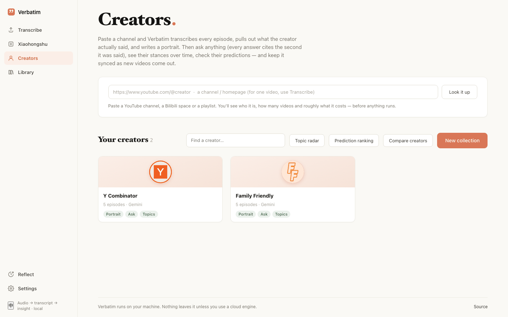

## Add a creator

1. Open **Creators**.
2. Paste a YouTube channel, a Bilibili space, or a playlist link into the box at the top. For a single
   video, use **Transcribe** instead.
3. Click **Look it up**. Nothing runs yet. Verbatim reads the channel list and shows who it is, how many
   videos, roughly how many hours, and how many you already transcribed.

   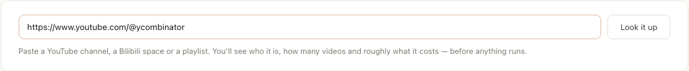

   If you analysed this creator before, it says so. **Open it** goes to the existing page, and
   **Fetch new videos** checks for new episodes. Starting again adds the picked videos to the existing
   analysis; nothing is done twice.
4. Under **1 Which videos**, pick the episodes:
   - **Latest N**, **All N**, or **Pick by hand**.
   - **Published since** and **Title contains** narrow the list. YouTube channel lists don't include
     publish dates, so use the title filter there.
   - Open the list to tick episodes one by one.
5. Under **2 What to do**, choose one:
   - **Full analysis (recommended)**: transcribe, pull out quotes, write the portrait.
   - **Transcripts only**: every episode transcribed plus one merged full text. Much cheaper. You can
     analyse later.
6. Optional switches:
   - **It's a call-in / interview channel — tell speakers apart**: uses an engine that labels speakers,
     so guests' words aren't credited to the host.
   - **Use existing subtitles when a video has them**: faster and free for those videos.
   - **Check predictions when done**: web-checks the predictions at the end (a few cents).
   - **Keep it up to date**: checks for new videos on a schedule (Weekly by default).
7. Check the estimate next to the button: number of videos, hours of audio, estimated cost and time.
   Episodes you already transcribed are free.
8. Click **Analyse N videos** (or **Transcribe N videos**). If the estimate is over $5 you are asked to
   confirm.

**Advanced settings — engine, model, language** holds the rest: **Transcription engine**,
**Analysis model** (Gemini by default; Claude via OpenRouter; DeepSeek, Kimi, GLM, Qwen via Alibaba),
**Name to use**, **Report language**, **Portrait tone** (Descriptive, Analytical, Sharp),
**Subtitle language**, and the switches **Verify facts (web)**, **Self-verify**, **Whisper fallback**,
**Episode summaries**. The defaults are fine for most channels.

A run takes a while. Progress shows on the creator's card and in the spinner at the top of the sidebar.
You can close the browser tab; the app keeps working as long as it is running.

## The creator list

Under **Your creators**:

- A search box, and buttons for **Topic radar**, **Prediction ranking**, **Compare creators**, and
  **New collection** (all covered below).
- Each card shows what is ready: **Portrait**, **Ask**, **Topics**.
- **Unfinished or failed** holds runs that stopped. Open one and use **Run details & actions →
  Continue** to finish only what is missing.
- You can hide a card. Hidden creators move to **Hidden** at the bottom; their data is kept.

## The creator page

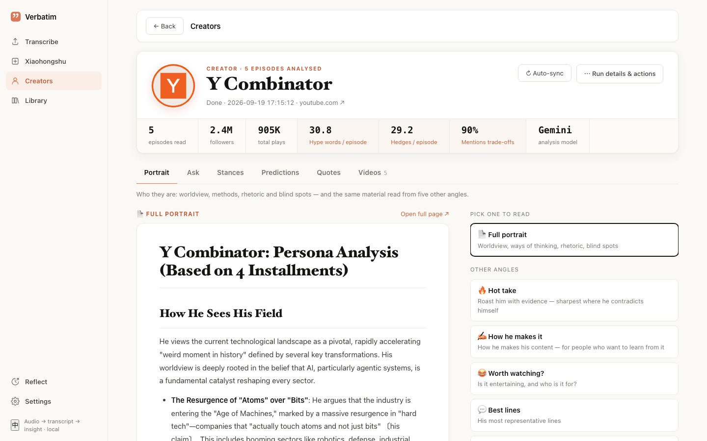

The header shows episodes read, followers, total plays, and three counted rhetoric numbers:
**Hype words / episode**, **Hedges / episode**, and **Mentions trade-offs**. On the right:
**↻ Auto-sync** and **Run details & actions** (source, settings, progress, **Continue**,
**Re-analyze**, **Stop**, episode documents, delete).

Below are six tabs. A tab only appears when its data exists.

### Portrait

The full portrait (worldview, ways of thinking, rhetoric, blind spots) on the left. Under
**Other angles** on the right are five more readings of the same quotes: **🔥 Hot take**,
**✍️ How he makes it**, **😂 Worth watching?**, **💬 Best lines**, **🗺 Views at a glance**. If one hasn't
been made yet, click **Generate**; it reuses the existing quotes, so it is cheap. **Open full page ↗**
opens the document on its own page.

### Ask

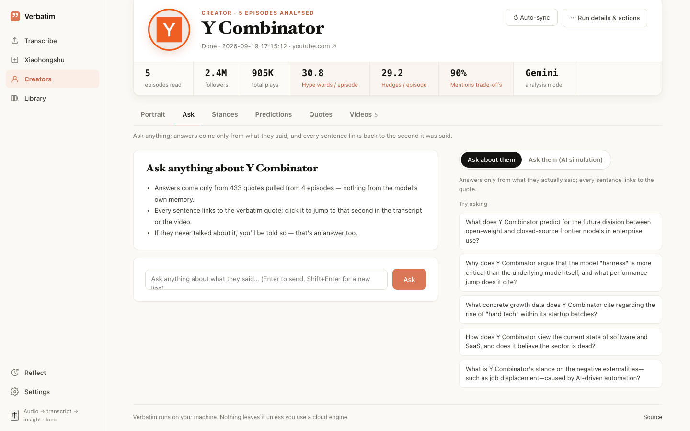

1. Pick a mode:
   - **Ask about them**: answers come only from what they said. Every sentence carries a source chip
     like `EP3 · 12:41`.
   - **Ask them (AI simulation)**: an AI imitates how they would answer. It is labelled as simulation,
     not their words, and the real quotes it rests on are listed under the answer.
2. Type a question and press Enter, or click one of the suggestions under **Try asking**.
3. Under each answer, a line tells you how much was searched (for example "Searched all 433 cards
   from 4 episodes").
4. Click a source chip to open **Sources** at that quote.

Each source shows the verbatim quote, a short AI note, the episode and date, the stance, and (in
interviews) who is speaking. From there you can:

- **Open transcript at 12:41**: the transcript, scrolled to that second.
- **Watch at 12:41**: the original video at that second.
- **▶ Listen**: play that stretch of audio (see [Listen](#listen)).
- **Share this quote**: make an image (see [Share image](#share-image)).

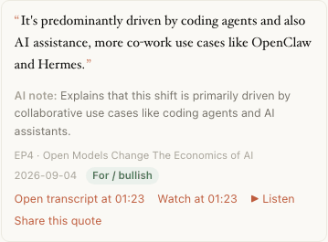

Notes:

- If they never talked about it, the answer says so. That is an answer too.
- If the model cites a quote it wasn't given, the citation is deleted and the answer says
  "N made-up citation(s) removed".
- The answer is in the language of your question.
- **Clear conversation** clears the thread. **Export** saves one answer or the whole conversation.
- Cost: in testing, one question cost $0.003–0.014.

### Stances

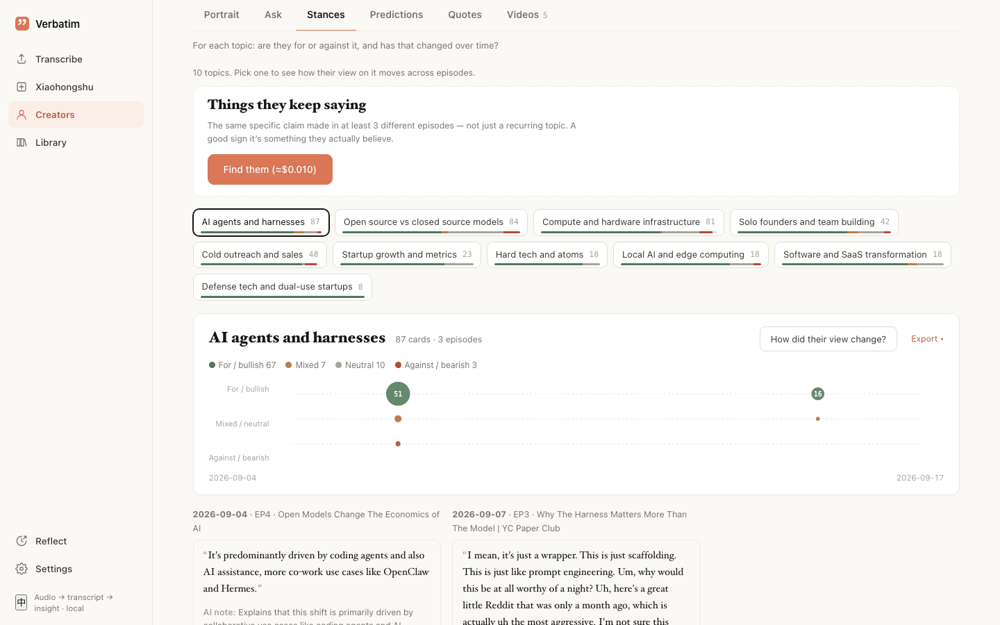

**Things they keep saying** sits at the top of the tab. It lists the same specific claim made in at
least 3 different episodes. Not the same topic, the same claim: a good sign it's something they
actually believe.

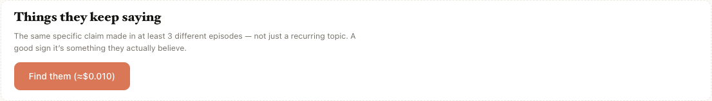

- Click **Find them (≈$…)**. It runs in the background; the button shows the estimated cost. For one
  creator this is roughly 1¢ to 18¢.
- Each item shows a one-line **AI summary:**, a quote, and "Said in N episodes · first → latest".
  Open it to see every quote with its source.
- **Look again** rebuilds the list.

Below that are the topics:

1. The first time, you may see **Topics aren't tagged yet**. Click **Tag cards (≈ $…)**. Each quote gets
   a topic, a stance, and a flag for whether it is a prediction. In testing this cost about $0.07 per
   1,000 quotes. Recent analyses do this automatically.
2. Click a topic chip. The number is how many quotes; the bar under it is the stance mix.
3. The timeline puts **For / bullish** on top and **Against / bearish** at the bottom. Bigger dots mean
   more quotes. Columns are publish dates, or episode order if dates are missing. **Fetch publish
   dates** fills them in (free).
4. Below the timeline, the quotes for that topic are listed by episode.
5. **How did their view change?** asks that question on the Ask tab. **Export** saves this page.

### Predictions

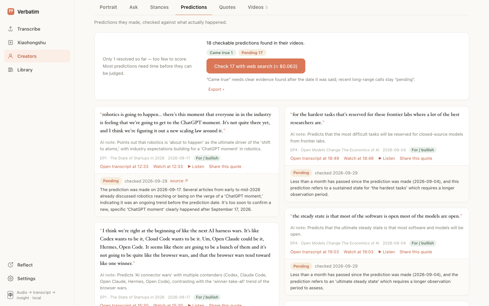

1. Predictions are picked out when quotes are tagged. If you see **No prediction ledger yet**, tag the
   quotes on the Stances tab first.
2. The tab shows how many checkable predictions were found. Click
   **Check N with web search (≈ $…)**. In testing this cost about $0.021 per batch of 8 predictions.
3. Each prediction gets a verdict: **Came true**, **Didn't**, **Pending**, **Unclear**, or
   **Not a prediction**, with the reason, the date checked, and a **source** link. Click a verdict
   badge at the top to filter.
4. **Came true** needs clear evidence, found after the date it was said, that the outcome happened in a
   later month than the one it was said in. Comments made after the fact count as
   **Not a prediction**. Recent long-range calls stay **Pending**.
5. A hit rate appears only once at least 5 predictions have a result.

**Read the hit rate as a rough guide, not a score.** The checking is automatic and can still get
individual verdicts wrong. Most predictions stay pending for a long time. Read the individual verdicts
before drawing conclusions, and don't use the number to promote or attack anyone.

### Quotes

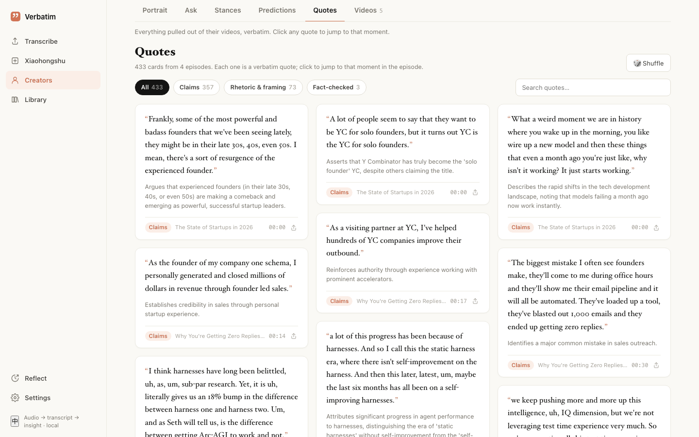

Everything pulled from their videos, word for word.

- Filter: **All**, **Claims**, **Rhetoric & framing**, **Fact-checked**. In interviews, you can also
  filter by speaker.
- **Search quotes…** and **Shuffle**.
- Click a quote to open that episode's transcript at that second.
- The share icon on a card makes a share image.

### Videos

Every episode with its status. Click a finished one to open its transcript. Tick **Add to merge** on
several episodes (across creators too), then click **Merge** in the bar at the bottom to get one merged
transcript. The merged view is not saved; download it before you leave.

## Listen

**▶ Listen** under a quote plays that stretch of the original audio, about 10 to 60 seconds depending
on the quote length.

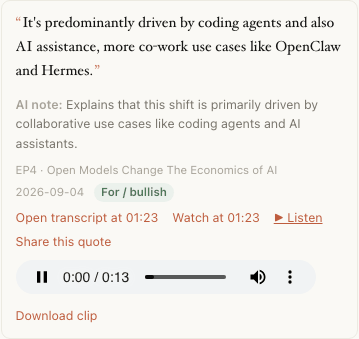

- The first time, Verbatim cuts that part from the original video, which takes about 10 seconds. After
  that it is cached.
- **Download clip** saves the audio file.
- It needs the original video link. Recordings without a source link have no Listen button.
- It is free (no model call).

## Export

Look for **Export ▾** on answers, the whole conversation, the Stances page, the Predictions tab, and
comparisons.

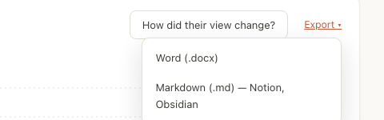

- **Word (.docx)** or **Markdown (.md) — Notion, Obsidian**.
- Sources become numbered footnotes with the quote and a link to the moment in the video.

## Keep it up to date (auto-sync)

1. On a creator page, click **↻ Auto-sync**. (Or tick **Keep it up to date** when you add the creator.)
2. Click it again to set **How often** (Daily, Weekly, Every 2 weeks, Monthly) and **Watch for**
   keywords.
3. **Sync now** runs it right away. **Turn off auto-sync** stops it.

What a sync does:

- Checks the newest 30 videos of the channel and takes the ones that are newer than anything already
  there.
- Downloads, transcribes, and analyses only those. Existing episodes, quotes, and tags are not touched.
- Updates the portrait in place and keeps the old version.
- Shows a note on the creator page ("N new video(s) · synced …") and a **New** badge in the list. If
  you set keywords, it tells you how many new quotes mention them.
- In testing, a sync with one new episode cost $0.18.

Syncs only happen while Verbatim is running.

## Collections

A collection is any set of recordings treated as one: interviews, a course, meetings, or several
creators together. You get the same tabs: an **Overview** instead of a portrait, Ask, Stances,
Predictions, Quotes, and **All items**.

1. On **Creators**, click **New collection**.
2. Name it and pick a type: **Interviews**, **Lectures / course**, **Meetings**, **Podcast / shows**,
   **Mixed**.
3. Tick recordings under **Transcripts**, or whole creators under **Whole creators**. **Search titles…**
   helps.
4. Click **Build collection**.

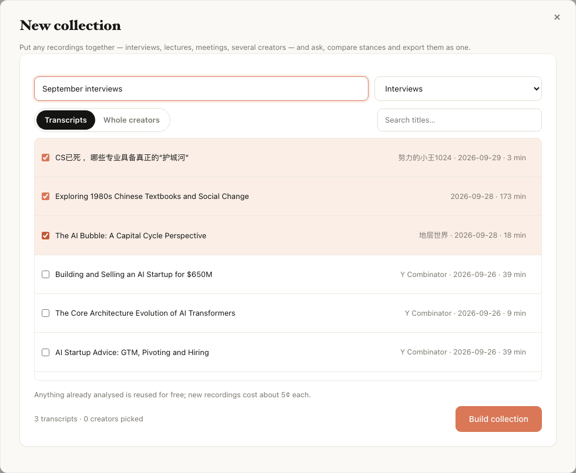

- Anything already analysed is reused for free. New recordings cost about 5¢ each. In testing, a
  5-episode collection took 4.5 minutes and $0.46.
- Later, **Add recordings** adds more (only the new ones are analysed), and **Rebuild** redoes the
  overview and tags.
- When you ask across a collection, answers say who said what, in which recording.

## Topic radar

One topic, every creator.

1. On **Creators**, click **Topic radar**.
2. Type a topic, for example "house prices" or "open source models", and click **Scan**.

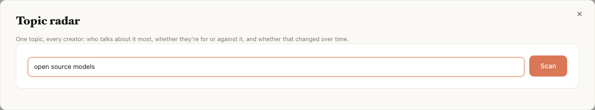

The table lists each creator who talks about it: how many quotes, the stance mix (**For**, **Against**,
**Mixed**), an overall score, and whether they got warmer or cooler from earlier to later episodes.
**Ask** asks that creator about the topic. **Compare the top N side by side** opens a comparison.

- Matching is by meaning, not only keywords, so different wording still matches.
- Collections are left out so the same quote isn't counted twice.

## Prediction ranking

On **Creators**, click **Prediction ranking**. It lists each creator's checked predictions: how many
came true, didn't, and are pending.

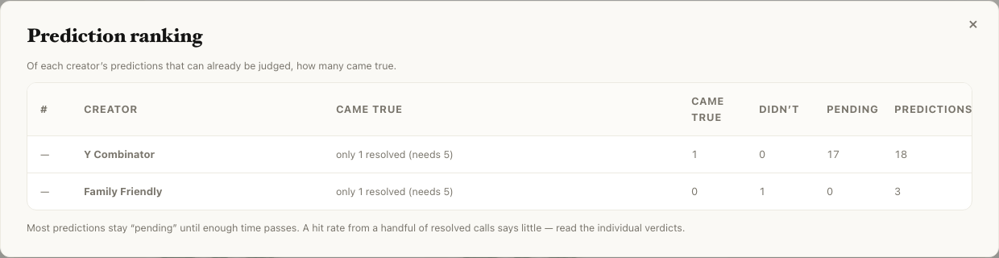

A creator is only ranked with at least 5 resolved predictions. As with the Predictions tab, this is a
rough guide. A rate from a handful of resolved calls says little.

## Compare creators

1. On **Creators**, click **Compare creators**.
2. Tick 2 to 4 creators.
3. Ask one question and click **Compare**.

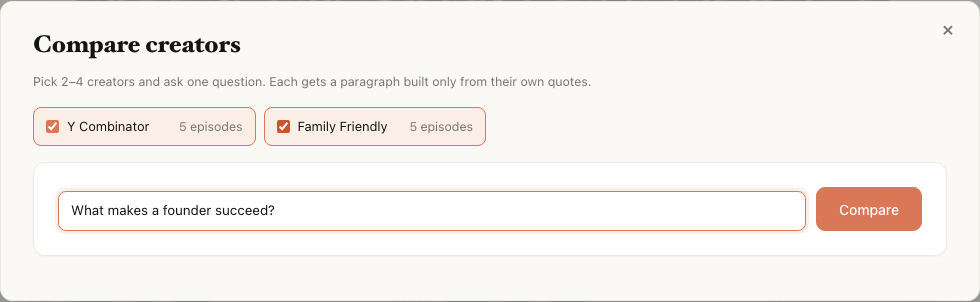

Each creator gets a paragraph built only from their own quotes, with sources. You can export the
result.

## Share image

**Share this quote** (or the share icon on a quote card) turns a quote into a 1080 × 1080 image with
the creator, episode, timestamp, and link.

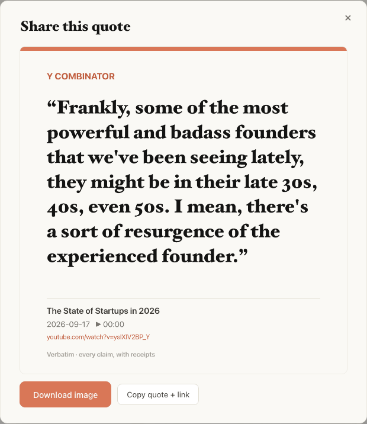

- **Download image** saves a PNG.
- **Copy quote + link** copies the text and a link to that moment.

## Things to know

- **Continue** after a crash or restart. A run doesn't resume on its own after the app restarts; it is
  marked failed. Open it and use **Run details & actions → Continue**. Finished work is reused.
- **Re-analyze** redoes only the analysis, with the settings currently in the Creators form.
  Transcripts are kept.
- **Cost adds up with episode count.** Check the estimate before starting, and see
  **Settings → Costs** afterwards.
- **Ask them (AI simulation)** writes in someone's voice. Don't present it as their words.
