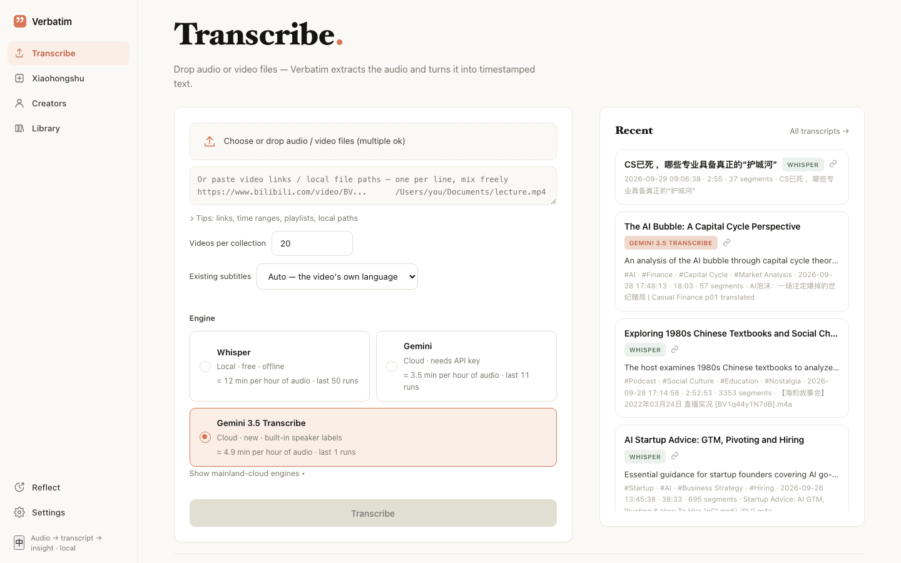
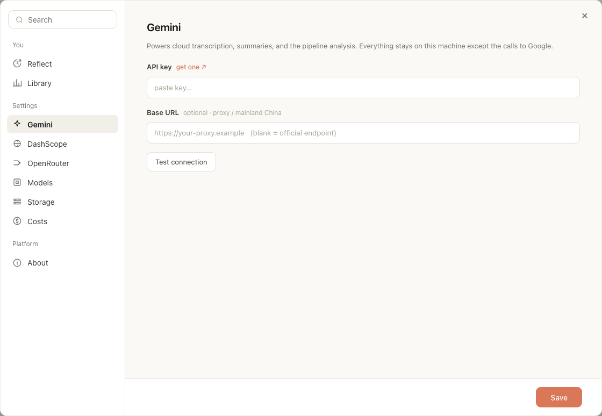
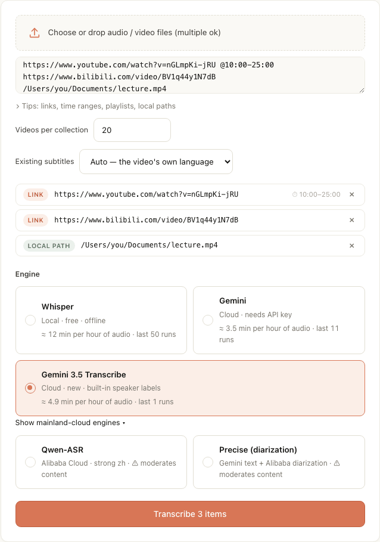
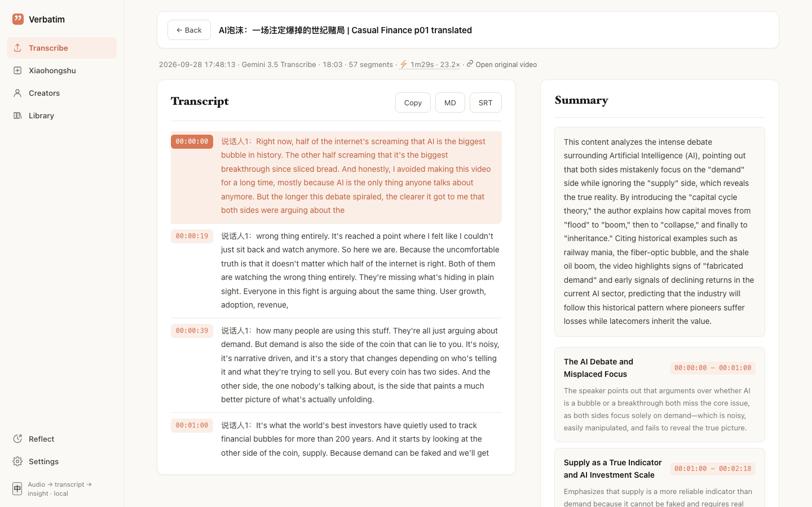
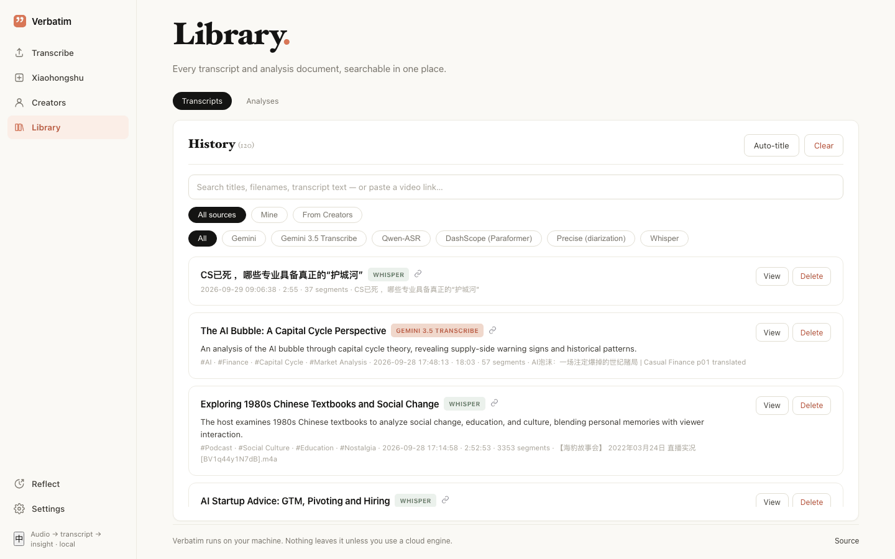
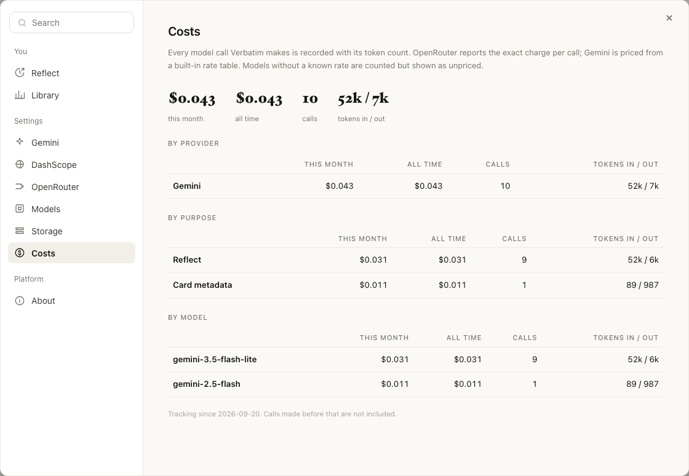

# Getting started

[中文版](zh-CN/getting-started.md) · Next: [Engines](engines.md) · [Creators](creators.md) · [FAQ](faq.md)

This guide takes you from download to your first transcript. It covers the Mac app. If you want to run
from source instead, see [Run from source](#run-from-source) at the end.

## 1. Install

1. Download `Verbatim.dmg` from the [Releases page](https://github.com/Kapozux/_Verbatim_/releases).
   It is built for Apple Silicon Macs (M1 and later).
2. Open the DMG and drag **Verbatim** into **Applications**.
3. The app is not signed. The first time, do not double-click it. Right-click (or Control-click)
   **Verbatim** in Applications, choose **Open**, then click **Open** again in the dialog.
   If macOS only offers **Move to Trash**, see [It won't open](faq.md#the-app-wont-open-gatekeeper).

You only need to do step 3 once.

## 2. First launch

1. After launch, **◉ Verbatim** appears in the menu bar at the top of the screen. There is no Dock
   window; the app runs in the menu bar.
2. Your browser opens `http://localhost:5001` by itself. If it doesn't, or you closed the tab, click
   **◉ Verbatim** in the menu bar and choose **Open in Browser** (**在浏览器中打开** on a Chinese system).
3. To quit, click **◉ Verbatim** and choose **Quit Verbatim** (**退出 Verbatim** on a Chinese system).

Everything you make is stored on your Mac in `~/Library/Application Support/Verbatim`.



The left sidebar has four pages: **Transcribe**, **Xiaohongshu**, **Creators**, **Library**. At the bottom
are **Reflect**, **Settings**, and a **中 / EN** button that switches the interface language.

> The **Xiaohongshu** page does not work in the packaged app. It needs a companion scraper that only
> runs from source.

## 3. Add an API key

Local Whisper works with no key. For the cloud engines, summaries, and creator analysis you need a
Gemini API key.

1. Get a key at [Google AI Studio](https://aistudio.google.com/apikey). The **get one ↗** link in
   Settings goes there too.
2. Click **Settings** in the sidebar, then **Gemini**.
3. Paste the key into **API key**.
4. Click **Test connection**. You should see a success message.
5. Click **Save**.



Keys are saved in `settings.local.json` in your data folder and only sent to the provider they belong
to. To keep a saved key, leave the field blank.

Other keys are optional:

- **DashScope** (Alibaba Cloud): needed for the **Qwen-ASR** and **Precise** engines.
- **OpenRouter**: needed only if you want Claude as the analysis model for creators.

See [Engines](engines.md) for what each one is for.

## 4. Transcribe your first file or link

Open **Transcribe** in the sidebar.

**To transcribe a file:**

1. Click **Choose or drop audio / video files (multiple ok)**, or drag files onto that box.
   Supported: mp3, wav, flac, m4a, ogg, webm, mp4, mov, mkv, avi, m4v.
2. Pick an engine (see below).
3. Click **Transcribe**.

**To transcribe a link:**

1. Paste one link per line into the box under the file picker. YouTube, Bilibili, and other sites that
   yt-dlp supports all work. You can mix links and local file paths.
2. Each line gets a tag: **Link**, **Local path**, or **?** (not recognised, will be skipped).
3. Click **Transcribe N items**.



Useful details (also under **Tips: links, time ranges, playlists, local paths**):

- **Only part of a video.** Add a time range after the link: `https://…/watch?v=xxx @10:00-25:00`, or
  `@5:30-` for "to the end". Only that part is downloaded and transcribed, and timestamps still match
  the original video.
- **Playlists and collections.** A playlist or Bilibili 合集 link is expanded into its videos.
  **Videos per collection** caps how many (default 20). For a whole channel with analysis, use
  [Creators](creators.md) instead.
- **Existing subtitles.** With **Auto — the video's own language** (the default), a video that already
  has captions in its own language uses them instead of transcribing. This is fast and free. Choose
  **Off — always transcribe the audio** to always transcribe.
- **Local paths** are read in place, nothing is copied. macOS blocks reading from Downloads and
  Desktop, so keep files in Documents or another folder.
- Up to 20 links per batch.

**Which engine?** The default, **Gemini 3.5 Transcribe**, is a good start: it labels speakers and needs
only the Gemini key. **Whisper** runs on your Mac for free but only when the Mac is plugged in. The full
comparison is in [Engines](engines.md).

While it runs, the **Queue** on the right shows each item's progress, time elapsed, and an estimate of
time left.

## 5. Read and export the result

When a row says **Done**, click it. Past transcripts are listed under **Recent** on the right, and all
of them are in **Library**.



On the transcript page:

- The top line shows date, engine, length, number of segments, processing time, cost, and an
  **Open original video** link for downloaded videos.
- **Transcript** on the left, timestamped. If a summary was written, it is on the right.
- **Copy** copies the text. **MD** downloads a Markdown file. **SRT** downloads subtitles.
- If there is no summary, **Summarize** writes one (one model call, about 1¢).
- New transcripts don't keep the audio by default, so there is usually no player. Turn on
  **Settings → Storage → Keep audio for playback** if you want one.

## 6. Find things later

**Library** lists every transcript.



- The search box searches titles, file names, and transcript text. You can also paste a video link to
  find its transcript.
- Filter by source (**All sources**, **Mine**, **From Creators**) or by engine.
- **Auto-title** asks AI to add titles and tags to records that don't have them.
- **Analyses** shows documents from creator analyses.

## 7. What it costs

Settings → **Costs** lists every model call with its token count and price: this month, all time, by
provider, by purpose, by model. Some models have no built-in price and are shown as unpriced.



## Backups

If Google Drive for desktop is installed and signed in, Verbatim copies your transcripts, summaries, and
analysis documents (never audio) to a `Verbatim_备份` folder in My Drive. It runs every 6 hours and 10
minutes after each new transcript, and never deletes anything. You can change the folder or run it
now in **Settings → Storage** (**Backup folder**, **Back up now**).

## Run from source

For developers. You need macOS or Linux, Python 3.9+, and Homebrew.

```bash
brew install ffmpeg yt-dlp          # use Homebrew's yt-dlp, not the pip package
git clone https://github.com/Kapozux/_Verbatim_.git && cd _Verbatim_/getAudio
pip install -r requirements.txt
bash run.sh                         # then open http://localhost:5001
```

- `run.sh` uses `../venv` if it exists, otherwise the system `python3`.
- Keys can go in Settings, or in `getAudio/.env`:

  ```ini
  GEMINI_API_KEY=...
  DASHSCOPE_API_KEY=...
  OPENROUTER_API_KEY=...
  ```

- When run from source, data lives next to the code in `getAudio/` (`results/`, `uploads/`,
  `tasks.db`, `usage.db`). Set `GETAUDIO_DATA_DIR` to put it elsewhere, and `PORT` to change the port.
- Setting `GETAUDIO_TOKEN` turns on a simple access token. Do this before exposing the server beyond
  localhost.
- `config.py` has the tuning knobs (engine concurrency, model names, download options).

### MCP server

`verbatim-mcp` lets Claude Code and other agents drive a running Verbatim over HTTP.

```bash
pipx install verbatim-transcribe-mcp
claude mcp add verbatim --scope user -- verbatim-mcp
```

The PyPI package (0.1.0) has the transcription and analysis tools. The creator workspace tools
(asking questions, stances, predictions, compare, topic radar, collections) are only in the repo
version so far. To get them, install from the checkout:

```bash
cd _Verbatim_/verbatim-mcp
python3 -m venv .venv && .venv/bin/pip install -e .   # needs Python 3.10+
claude mcp add verbatim --scope user -- "$PWD/.venv/bin/verbatim-mcp"
```

If Verbatim is not on `http://127.0.0.1:5001`, set `VERBATIM_URL`. See `verbatim-mcp/README.md` for
Claude Desktop setup.
