# 博主分析工作台

[English](../creators.md) · [快速上手](getting-started.md) · [转写引擎](engines.md) · [常见问题](faq.md)

**博主** 页把一整个频道变成可以反复查问的资料。Verbatim 会转写你挑的每一期，摘出原话（每条都对应到说这句话的那一秒），
再根据这些原话写一份人物画像。之后你可以提问、看立场怎么变、核对他说过的预测。

这一页的所有功能都需要 Gemini key，见[快速上手](getting-started.md#3-填-api-key)。

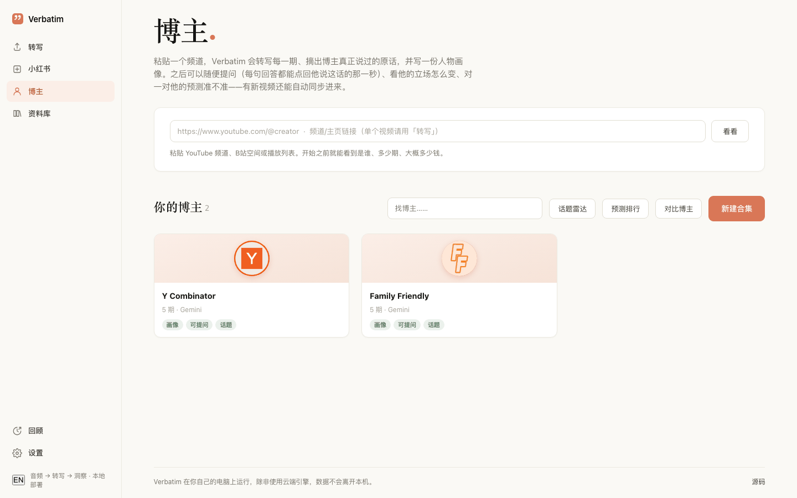

## 新建博主

1. 打开 **博主**。
2. 把 YouTube 频道、B站空间或播放列表的链接粘到顶部输入框。只转一个视频的话用 **转写** 页。
3. 点 **看看**。这一步什么都不会跑，只是读频道列表，告诉你是谁、多少期、大概多少小时、其中多少期你已经转写过。

   

   之前分析过这个博主的话会提示你。**打开** 进入已有的页面，**拉取新视频** 检查有没有新的期。
   在这里再开始，会把挑的期并进原来那次分析，做过的不会重做。
4. 在 **1 分析哪些期** 里挑：
   - **最新 N 期**、**全部 N 期** 或 **手动挑**。
   - **发布日期不早于** 和 **标题包含** 用来缩小范围。YouTube 的频道列表不带发布日期，只能用标题筛。
   - 展开列表可以一期期勾。
5. 在 **2 要做什么** 里选一个：
   - **完整分析（推荐）**：转写、摘原话、写人物画像。
   - **只要转写**：每期转写 + 一份合并全文，不做分析，便宜很多。以后想分析随时可以。
6. 可选开关：
   - **这是连麦 / 访谈类频道，要区分谁在说话**：换用能标出说话人的转写引擎，嘉宾的话不会算到博主头上。
   - **有字幕就先用字幕**：这些期更快、不花转写费。
   - **分析完自动核对预测**：最后联网核对他说过的预测（几美分）。
   - **以后自动更新**：按频率检查新视频（默认每周）。
7. 看按钮旁边的预估：多少期、约多少小时音频、预计花费和时间。已经转写过的期不花钱。
8. 点 **分析这 N 期**（或 **转写这 N 期**）。预估超过 5 美元时会再确认一次。

**高级设置——引擎、模型、语言** 里是其余选项：**转写引擎**、**分析模型**（默认 Gemini；也可以通过 OpenRouter 用 Claude，
通过阿里云用 DeepSeek、Kimi、GLM、Qwen）、**显示名字**、**报告语言**、**画像语气**（描述型、分析型、犀利型）、**字幕语言**，
以及 **联网核实事实**、**自我证伪**、**Whisper 兜底**、**每期摘要** 几个开关。大多数频道用默认值就行。

跑一次要一段时间。进度显示在博主卡片上，也显示在左边栏顶部的转圈图标里。浏览器标签页可以关，只要应用在运行就会继续。

## 博主列表

**你的博主** 下面有：

- 搜索框，以及 **话题雷达**、**预测排行**、**对比博主**、**新建合集** 几个按钮（后面分别介绍）。
- 每张卡片标出已经能用的功能：**画像**、**可提问**、**话题**。
- **没跑完或失败的** 里是中途停下的。点开，用 **运行详情与操作 → 继续** 只补缺的部分。
- 卡片可以隐藏，隐藏后挪到底部的 **已隐藏** 里，数据不删。

## 博主页

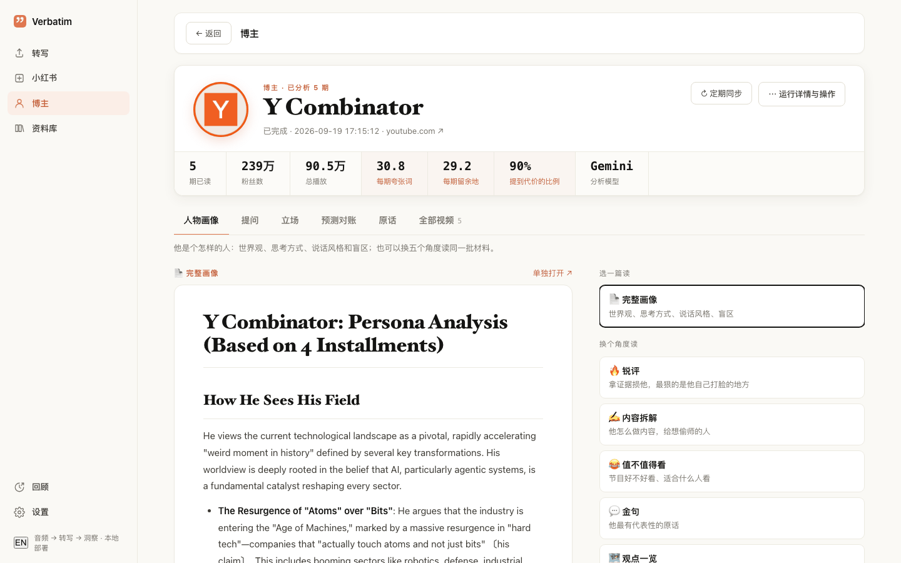

顶部显示期已读、粉丝数、总播放，以及三个按次数统计的说话风格指标：**每期夸张词**、**每期留余地**、**提到代价的比例**。
右边是 **↻ 定期同步** 和 **运行详情与操作**（来源、设置、进度、**继续**、**重新分析**、**停止**、分集文档、删除）。

下面有六个标签，有对应数据才会出现。

### 人物画像

左边是完整画像（世界观、思考方式、说话风格、盲区）。右边 **换个角度读** 里还有五种读法，用的是同一批原话：
**🔥 锐评**、**✍️ 内容拆解**、**😂 值不值得看**、**💬 金句**、**🗺 观点一览**。还没生成的点 **生成**，复用现有原话，花费很少。
**单独打开 ↗** 在单独页面打开这篇文档。

### 提问

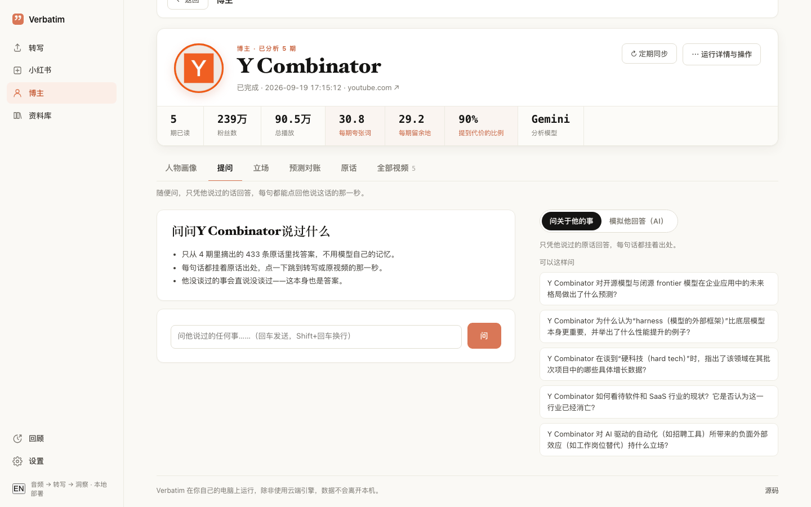

1. 选回答方式：
   - **问关于他的事**：只凭他说过的原话回答，每句话后面挂着出处芯片，比如 `EP3 · 12:41`。
   - **模拟他回答（AI）**：AI 模仿他的口吻回答。会标明是 AI 模拟、不是他本人说的，并在下面列出所依据的真实原话。
2. 输入问题按回车，或者点 **可以这样问** 下面的问题。
3. 每条回答下面有一行说明查了多少内容，比如「查了全部 433 张卡，来自 4 期」。
4. 点出处芯片，会展开 **出处** 并定位到那条原话。

每条出处显示原话、一句 AI 转述、期数和日期、立场，访谈类还会显示是谁说的。在这里可以：

- **打开转写，跳到 12:41**：打开转写稿并滚到那一秒。
- **看原视频 12:41**：从那一秒打开原视频。
- **▶ 听这段**：播放那一小段音频（见[听这段](#听这段)）。
- **分享这句原话**：生成分享图（见[分享图](#分享图)）。

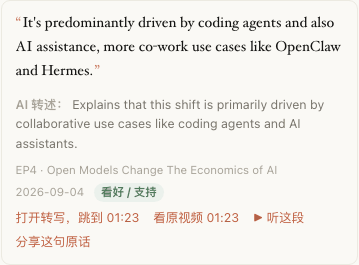

说明：

- 他没谈过的事会直说没谈过，这本身也是答案。
- 模型引用了没给它的原话时，这个出处会被删掉，回答下面会写「删掉了 N 个编造的出处」。
- 回答用你提问的语言。
- **清空对话** 清掉这一串对话。**导出** 可以保存单条回答或整段对话。
- 费用：测试中每问一次花 $0.003–0.014。

### 立场

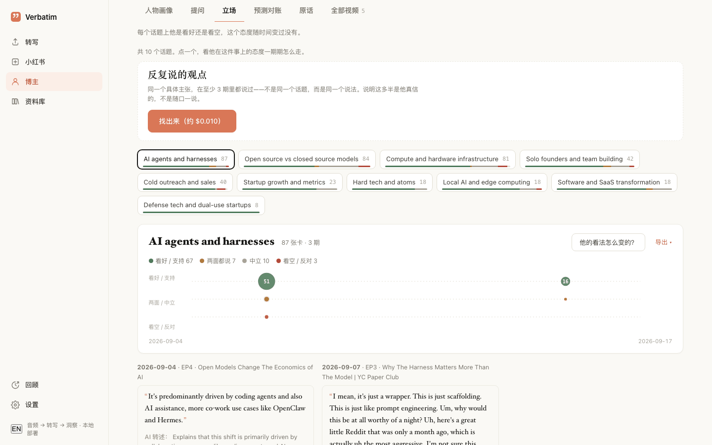

标签顶部是 **反复说的观点**：同一个具体主张在至少 3 期里都说过才算。不是同一个话题，而是同一个说法，说明这多半是他真信的。

- 点 **找出来（约 $…）**，在后台生成，按钮上显示预估费用。一个博主大约 1 到 18 美分。
- 每条显示一句 **AI 归纳：**、一条原话，以及「在 N 期里说过 · 首次 → 最近」。展开能看到全部原话和出处。
- **重新找** 重新生成。

下面是各个话题：

1. 第一次打开可能看到 **还没给卡片打话题**。点 **打标签（约 $…）**，每条原话会被标上话题、立场，以及是不是预测。
   测试中大约每 1,000 条 $0.07。较新的分析会自动做这一步。
2. 点一个话题。数字是原话条数，下面的色条是立场分布。
3. 时间线上 **看好 / 支持** 在上，**看空 / 反对** 在下，点越大表示原话越多。横轴是发布日期，没有日期时按期数顺序。
   **补发布日期** 可以补上日期（免费）。
4. 时间线下面按期列出这个话题的原话。
5. **他的看法怎么变的？** 会把这个问题发到「提问」标签。**导出** 保存这一页。

### 预测对账

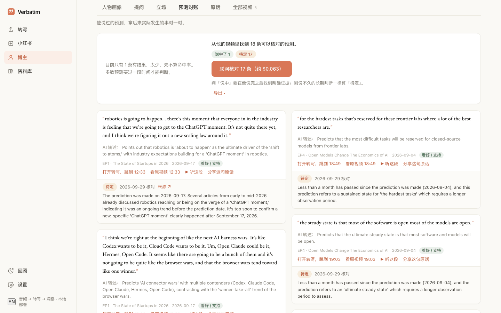

1. 预测是在给原话打标签时挑出来的。看到 **还没有预测记账** 的话，先去「立场」标签打标签。
2. 页面显示找到了多少条可以核对的预测。点 **联网核对 N 条（约 $…）**。测试中每批 8 条约 $0.021。
3. 每条预测会得到一个结论：**说中了**、**没说中**、**待定**、**说不清** 或 **不算预测**，附理由、核对日期和 **来源** 链接。
   点顶部的结论标签可以筛选。
4. 判「说中」要在他说完之后找到明确证据，而且结果发生的月份要晚于他说这话的月份。事后评论会被判为 **不算预测**。
   刚说不久的长期判断一律算 **待定**。
5. 有结果的预测至少 5 条时才显示命中率。

**命中率只供参考，不是评分。** 核对是自动的，个别结论仍可能判错。多数预测要很久才有结果。下结论之前请逐条看，
也不要拿这个数字去吹捧或攻击任何人。

### 原话

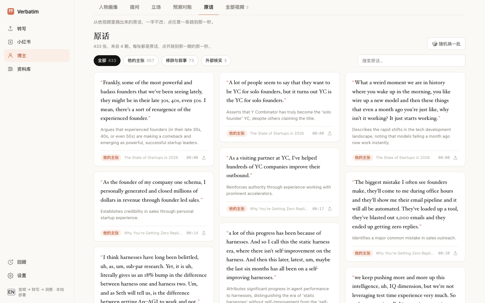

从他视频里摘出来的原话，一字不改。

- 筛选：**全部**、**他的主张**、**修辞与叙事**、**外部核实**。访谈类还能按说话人筛。
- **搜索原话…** 和 **随机换一批**。
- 点一条原话，打开那一期的转写并跳到那一秒。
- 卡片上的分享图标可以生成分享图。

### 全部视频

列出每一期和它的状态。点完成的期打开转写。在几期上勾 **加入合并**（可以跨博主），再点底部条上的 **合并**，
得到一份合并的转写。合并结果不会保存，离开页面前记得下载。

## 听这段

原话下面的 **▶ 听这段** 播放原视频里对应的那一小段，按原话长短大约 10 到 60 秒。

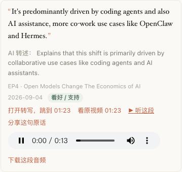

- 第一次会从原视频里截这一段，大约 10 秒。之后有缓存。
- **下载这段音频** 保存音频文件。
- 需要原视频链接。没有来源链接的录音不显示这个按钮。
- 不花钱（不调用模型）。

## 导出

回答、整段对话、立场页、预测对账和对比结果上都有 **导出 ▾**。

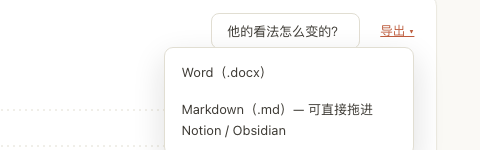

- 可以选 **Word（.docx）** 或 **Markdown（.md）— 可直接拖进 Notion / Obsidian**。
- 出处会变成带编号的脚注，附原话和跳到视频那一秒的链接。

## 定期同步

1. 在博主页点 **↻ 定期同步**（新建博主时勾 **以后自动更新** 也一样）。
2. 再点一次可以设 **频率**（每天、每周、每两周、每月）和 **关注词**。
3. **现在同步** 马上跑一次，**关闭定期同步** 停掉。

同步时会：

- 看频道最新的 30 期，只取比已有内容更新的那几期。
- 只下载、转写、分析这些新期，已有的期、原话、标签都不动。
- 在原画像基础上更新，旧版本会留底。
- 在博主页顶部显示「新增 N 期 · … 同步」，列表卡片上出现 **新** 标记。设了关注词的话，会告诉你有几条新原话提到了它们。
- 测试中同步 1 个新期花了 $0.18。

只有 Verbatim 在运行时才会同步。

## 合集

合集是把任意一批录音当成一个整体：访谈、课程、会议，或者几个博主放在一起。标签和博主页一样，
只是「人物画像」换成 **综述**，「全部视频」换成 **全部内容**。

1. 在 **博主** 页点 **新建合集**。
2. 起个名字，选类型：**访谈**、**课程 / 讲座**、**会议**、**播客 / 节目**、**混合**。
3. 在 **按转写挑** 里勾录音，或者在 **整个博主** 里勾博主。可以用 **搜标题……** 找。
4. 点 **建合集**。

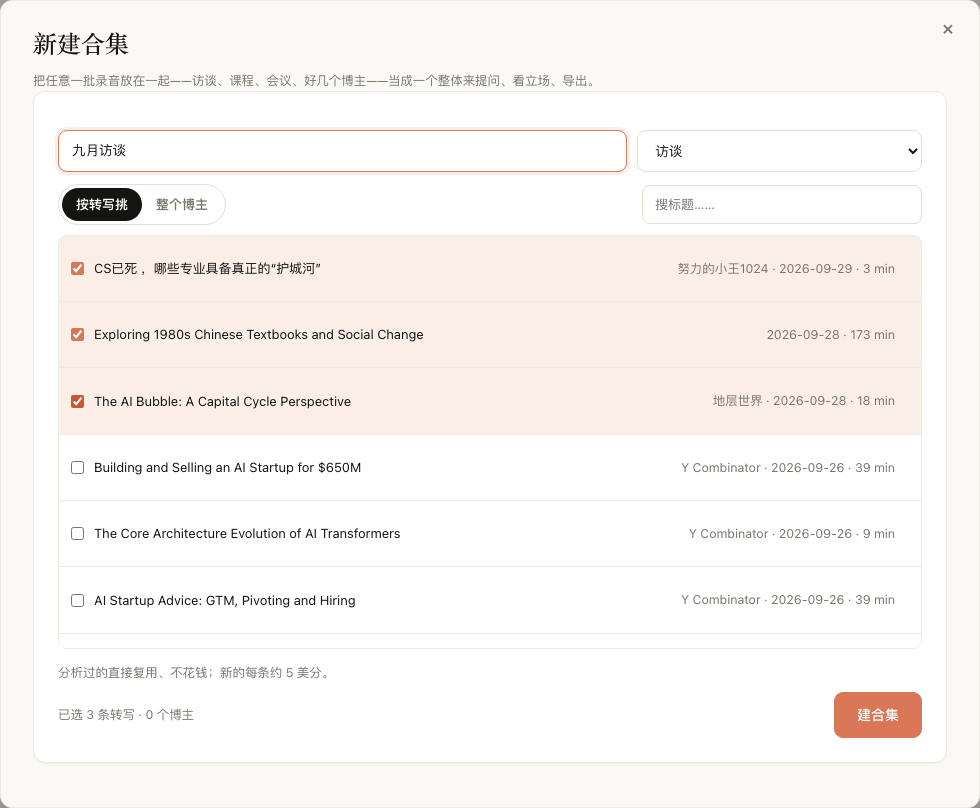

- 分析过的直接复用、不花钱；新的每条约 5 美分。测试中一个 5 期的合集用了 4.5 分钟、$0.46。
- 之后可以用 **加内容** 往里加（只分析新加的），**重新构建** 重做综述和标签。
- 在合集里提问，回答会写明是谁、在哪一条录音里说的。

## 话题雷达

一个话题，所有博主一起看。

1. 在 **博主** 页点 **话题雷达**。
2. 输入一个话题，比如「房价」「开源模型」，点 **扫一遍**。

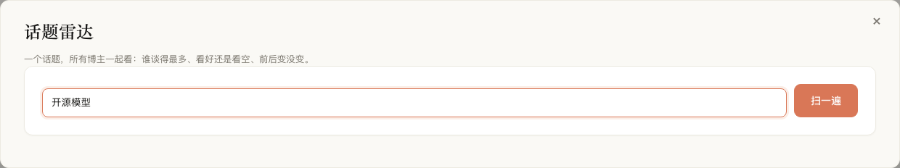

表格列出谈到这个话题的每个博主：原话条数、立场分布（**看好**、**看空**、**两面**）、**总体** 倾向，以及
**前期 → 近期** 是变得更看好还是更看空。**问他** 就这个话题去问那个博主。**把前 N 个放一起对比** 打开对比。

- 按意思匹配，不只看关键词，说法不同也能找到。
- 合集不计入，避免同一条原话被算两次。

## 预测排行

在 **博主** 页点 **预测排行**，列出每个博主核对过的预测里说中、没说中、待定各多少。

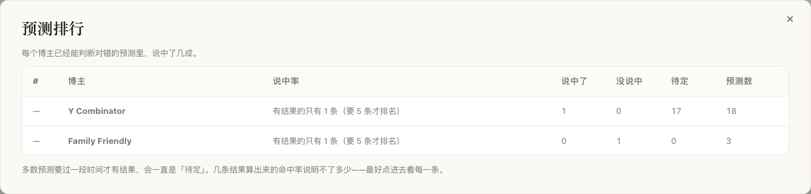

有结果的预测至少 5 条才排名。和「预测对账」一样只供参考，几条结果算出来的命中率说明不了多少。

## 对比博主

1. 在 **博主** 页点 **对比博主**。
2. 勾 2 到 4 个博主。
3. 输入一个问题，点 **对比**。

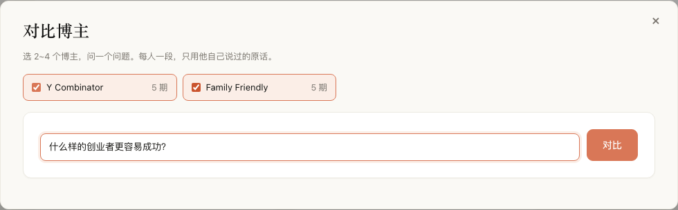

每个博主一段，只用他自己说过的原话，带出处。结果可以导出。

## 分享图

**分享这句原话**（或原话卡片上的分享图标）把一条原话做成 1080 × 1080 的图，带博主、期数、时间点和链接。

- **下载图片** 保存 PNG。
- **复制原话 + 链接** 复制文字和跳到那一刻的链接。

## 注意事项

- **崩溃或重启后用「继续」。** 应用重启后分析不会自动接着跑，会被标成失败。点开，用 **运行详情与操作 → 继续**，
  已完成的部分会复用。
- **重新分析** 只重做分析，用的是博主表单当前的设置，转写保持不变。
- **费用随期数增加。** 开始前看一眼预估，之后在 **设置 → 费用** 里核对。
- **模拟他回答（AI）** 是模仿某人的口吻，不要把它当成本人说的话发出去。
