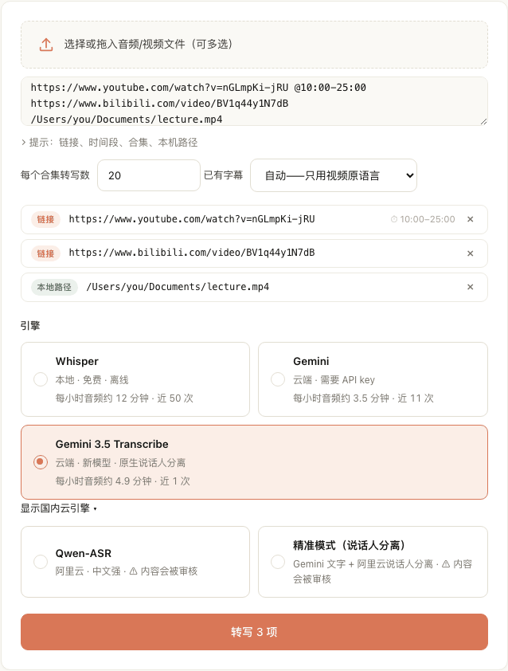

# 转写引擎

[English](../engines.md) · [快速上手](getting-started.md) · [博主分析](creators.md) · [常见问题](faq.md)

引擎在 **转写** 页的 **引擎** 下面选。博主分析里在 **高级设置——引擎、模型、语言 → 转写引擎**。
**显示国内云引擎 ▾** 下的两个引擎要点开才会出现。

每个引擎下面会显示它在你电脑上的实际速度，比如「每小时音频约 4.9 分钟 · 近 12 次」。这是按你自己的历史算的，会随使用变化。

## 一览

| 引擎（界面上的名字） | 在哪跑 | 需要的 key | 区分说话人 | 适合 |
|---|---|---|---|---|
| **Gemini 3.5 Transcribe**（默认） | Google 云端 | Gemini | 是 | 大多数情况；访谈、连麦 |
| **Gemini** | Google 云端 | Gemini | 否 | 中英混杂 |
| **Whisper** | 本机 | 不需要 | 否 | 免费、离线、私密内容 |
| **Qwen-ASR** | 阿里云（国内） | DashScope | 是 | 不敏感的中文内容 |
| **精准模式（说话人分离）** | Google + 阿里云 | Gemini 和 DashScope | 是 | 旧的双引擎说话人方案 |
| 字幕直取（不能手动选） | — | 不需要 | 否 | 本身带字幕的视频 |

## Gemini 3.5 Transcribe

- 所有地方的默认引擎。
- 用的是 Google 的语音模型 `gemini-3.5-transcribe`（预览版）。一次调用同时给出文字、逐词时间和说话人标签
  （每行开头的「说话人1：」「说话人2：」）。
- 长音频会切成最长 28 分钟一段。说话人是每段各自编号的，所以长录音里前一段的「说话人1」和后一段的「说话人1」不一定是同一个人。
- 被 Google 限流（HTTP 429）时，所有正在跑的任务会一起等，然后接着跑，不会被判失败。
- 需要 Gemini key。每条转写之后的摘要也用 Gemini。
- 费用：内置价格表里没有这个模型的价格，所以 **设置 → 费用** 里它的调用显示为未计价。实际花费看 Google 的账单页。

## Gemini

- 用通用 Gemini 模型转写。默认 `gemini-2.5-flash`，可以在 **设置 → 模型 → Gemini · 转写模型** 里改。
- 保留原语言，不翻译。说话人在中英文之间来回切换时效果好。
- 不区分说话人。
- 音频按 15 分钟一段发送。
- 需要 Gemini key。它的调用在 **设置 → 费用** 里有价格。

## Whisper

- 在你的 Mac 上跑。不上传任何东西，不需要 key，引擎本身免费。
- 第一次用会下载模型。内置默认是 `large-v3`（约 3 GB）。可以在 **设置 → 模型 → Whisper 模型** 里选更小的，
  更快，但中文准确率会下降。
- **只在插着电源时运行。** 用电池时任务会失败，提示你插上电源或改用云端引擎。Whisper 会占满所有性能核，
  曾经有一次用电池跑长任务，跑到一半电脑没电关机。
- 它也是兜底引擎：Gemini 因内容原因拒绝某个文件，或者云端引擎返回空稿时，这个文件会自动改用 Whisper 重转。
  博主分析里勾上 **Whisper 兜底**，其他云端失败（额度、报错）也会兜底。用电池时兜底同样会被挡住。
- 即使用 Whisper，每条转写之后的摘要和 AI 标题仍然是云端调用（每条约 1 美分）。没有 Gemini key 就跳过这两步，转写本身不受影响。

## Qwen-ASR

- 阿里云语音识别（当前是 `qwen-audio-3.1-asr-flash-filetrans`）。中文强，带说话人标签。
- 需要 DashScope key（**设置 → DashScope**）。这些转写的摘要用 Qwen 写。
- **内容会被审核。** 音频会发到国内的阿里云，政治敏感内容可能被拒绝、出乱码或被改动。选它的时候界面会先弹窗确认。
  敏感内容请用 Whisper 或 Gemini。
- 在博主表单里它叫 **阿里云 Qwen-ASR（中文强 · 不受 Gemini 内容过滤）**：不经过 Gemini 的内容过滤，
  适合 Gemini 老是拦截、但又不涉及政治敏感的内容。
- **设置 → 费用** 按音频时长记录它的调用，但没有内置价格。

## 精准模式（说话人分离）

- 用 Gemini 出文字、阿里云判断「谁在什么时候说话」，再合并。
- 需要 Gemini 和 DashScope 两个 key。和 Qwen-ASR 一样有内容审核的问题。
- 只有这个引擎会出现 **预计说话人数**。填了能提高准确率，留空则自动判断。
- Gemini 3.5 Transcribe 一次调用、一个 key 就能区分说话人，更简单。

## 字幕直取（快速路径）

不是一个能手动选的引擎，但在转写详情里会看到 **字幕直取**。

- **转写** 页的 **已有字幕** 默认是 **自动——只用视频原语言**。链接里的视频本身有原语言字幕时，直接用字幕，
  不下载、不转写。快，而且不花钱。
- 不会用机器翻译的字幕。选一个具体语言就只认这个语言，没有就转写音频。选 **关闭——一律转写音频** 就关掉。
- 看起来被截断的字幕会被丢掉，改为转写音频。
- 带时间段（`@10:00-25:00`）的链接不查字幕，因为字幕时间对不上片段。
- 博主分析里对应的选项是 **有字幕就先用字幕**。自动字幕的质量可能不如转写。字幕没有说话人，
  所以勾了「要区分谁在说话」时这个选项不生效。

## DashScope（Paraformer）

老记录的引擎可能显示为 **DashScope（Paraformer）**，资料库里也有这个筛选项。这是早期的阿里云引擎，
现在新转写不再提供，老记录照常能打开。

## 费用

- 每次模型调用都有记录，见 **设置 → 费用**，按服务商、用途、模型汇总。
- 没有内置价格的引擎（Gemini 3.5 Transcribe、Qwen-ASR）只计次数，显示为未计价。开发者可以在 `tasks.db` 旁边放一个
  `prices.json` 补价格。
- 摘要每条约 1 美分。作者自己的记录里，1,350 次 Gemini 摘要调用合计 $15.87，每条略高于 1 美分。
- 博主分析开始前，新建博主表单会给出预估。见[博主分析](creators.md)。

## 怎么选

- **刚开始用：** Gemini 3.5 Transcribe。
- **没有 key，或者是私密录音：** Whisper，记得插电。
- **中英混杂、不需要区分说话人：** Gemini。
- **Gemini 老是拦截的中文内容，且不涉及政治敏感：** Qwen-ASR。
- **本身带字幕的 YouTube / B站视频：** **已有字幕** 保持「自动」即可。
