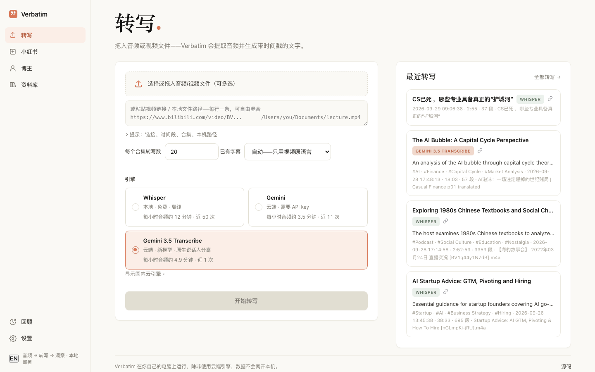
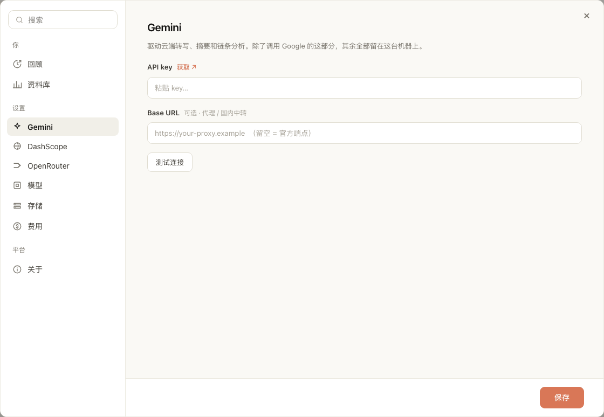
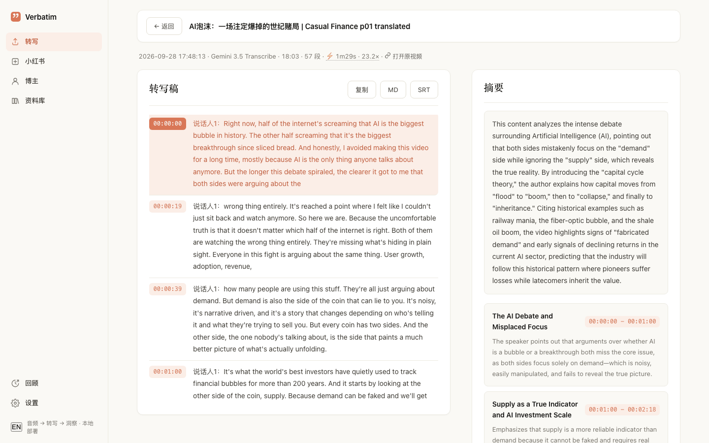
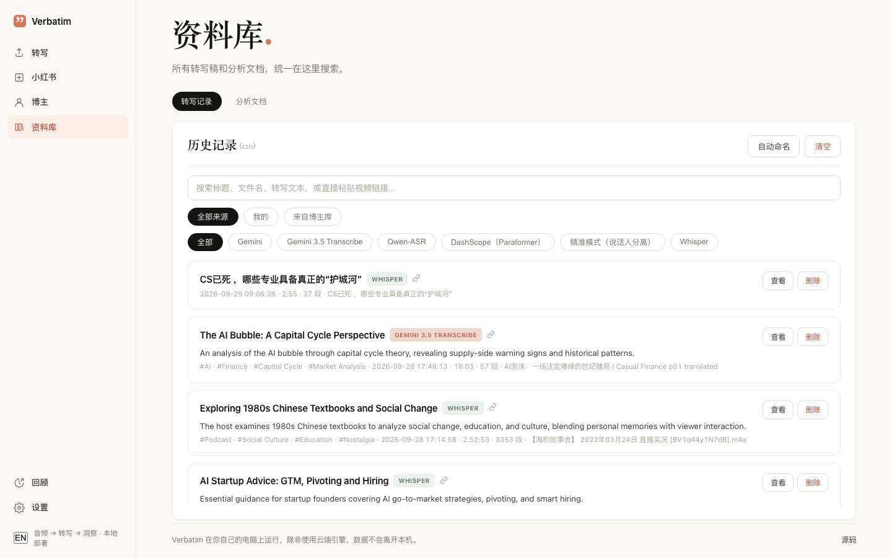
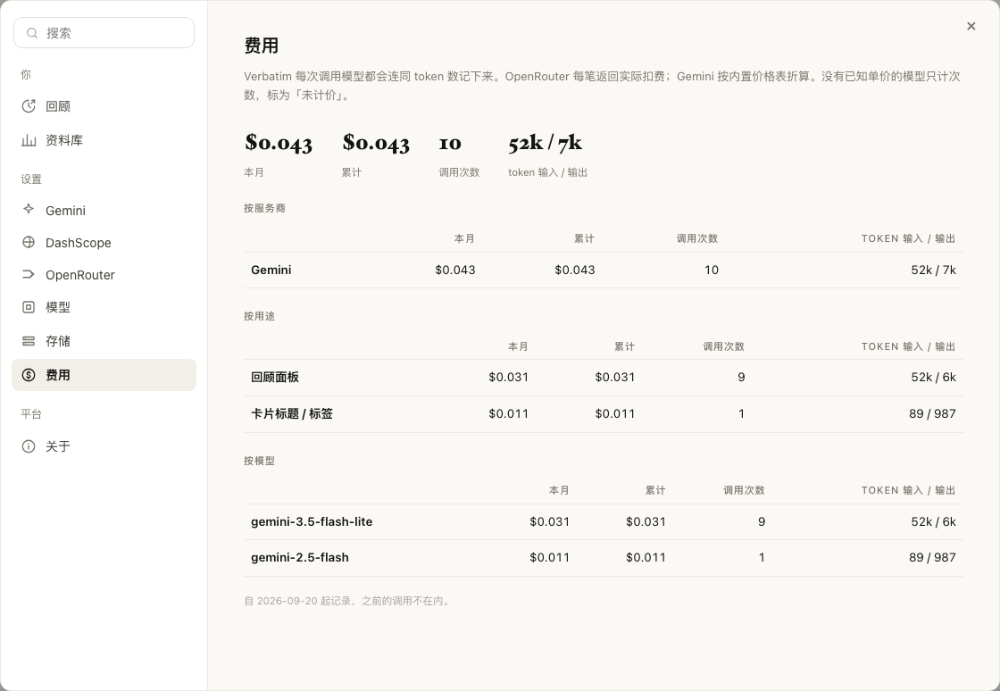

# 快速上手

[English](../getting-started.md) · 接着看：[转写引擎](engines.md) · [博主分析](creators.md) · [常见问题](faq.md)

这篇从下载讲到拿到第一份转写稿，讲的是 Mac 应用。想从源码运行，看文末的[从源码运行](#从源码运行)。

## 1. 安装

1. 到 [Releases 页面](https://github.com/Kapozux/_Verbatim_/releases)下载 `Verbatim.dmg`。
   只支持 Apple Silicon 芯片的 Mac（M1 及以后）。
2. 打开 DMG，把 **Verbatim** 拖进「应用程序」。
3. 这个应用没有签名。第一次不要双击。在「应用程序」里右键（或按住 Control 点按）**Verbatim**，
   选「打开」，弹窗里再点一次「打开」。
   如果弹窗里只有「移到废纸篓」，看[打不开怎么办](faq.md#打不开gatekeeper-拦截)。

第 3 步只需要做一次。

## 2. 第一次打开

1. 启动后，屏幕顶部菜单栏会出现 **◉ Verbatim**。它没有程序坞窗口，常驻在菜单栏。
2. 浏览器会自己打开 `http://localhost:5001`。没打开或者关掉了标签页，就点菜单栏的
   **◉ Verbatim**，选 **在浏览器中打开**。
3. 要退出，点 **◉ Verbatim**，选 **退出 Verbatim**。

你的所有数据都存在本机的 `~/Library/Application Support/Verbatim`。



左边栏有四个页面：**转写**、**小红书**、**博主**、**资料库**。底部是 **回顾**、**设置**，以及切换界面语言的
**中 / EN** 按钮。

> 打包版里 **小红书** 页用不了。它依赖一个只能从源码运行的配套采集项目。

## 3. 填 API key

本地 Whisper 不需要 key。云端引擎、摘要和博主分析都需要 Gemini API key。

1. 到 [Google AI Studio](https://aistudio.google.com/apikey) 申请一个 key。设置里的 **获取 ↗** 链接也是去这里。
2. 点左边栏的 **设置**，再点 **Gemini**。
3. 把 key 粘到 **API key** 里。
4. 点 **测试连接**，确认连得上。
5. 点 **保存**。



key 保存在数据目录的 `settings.local.json` 里，只会发给它所属的服务商。已经存过的 key，输入框留空就是保持不变。

其他 key 都是可选的：

- **DashScope**（阿里云）：用 **Qwen-ASR** 和 **精准模式** 两个引擎时需要。
- **OpenRouter**：只有想让 Claude 做博主分析时才需要。

各自适合做什么，见[转写引擎](engines.md)。

## 4. 转写第一个文件或链接

点左边栏的 **转写**。

**转写本地文件：**

1. 点 **选择或拖入音频/视频文件（可多选）**，或者直接把文件拖到这个框里。
   支持 mp3、wav、flac、m4a、ogg、webm、mp4、mov、mkv、avi、m4v。
2. 选一个引擎（见下文）。
3. 点 **开始转写**。

**转写链接：**

1. 把链接粘到文件框下面的输入框里，一行一条。YouTube、B站以及 yt-dlp 支持的其他网站都可以。
   链接和本机文件路径可以混着贴。
2. 每一行会标上 **链接**、**本地路径** 或 **?**（认不出来，会被跳过）。
3. 点 **转写 N 项**。


几个有用的细节（**提示：链接、时间段、合集、本机路径** 里也有）：

- **只要视频的一段**：在链接后面加时间段，比如 `https://…/watch?v=xxx @10:00-25:00`，
  或者 `@5:30-` 表示到结尾。只下载、转写这一段，时间戳仍然对应原视频的位置。
- **合集和播放列表**：B站合集、YouTube 播放列表会展开成里面的每个视频分别转写。
  **每个合集转写数** 控制最多转几个（默认 20）。想转整个频道并做分析，用[博主](creators.md)。
- **已有字幕**：默认是 **自动——只用视频原语言**。视频本身带原语言字幕时直接用字幕，不再转写，快而且不花钱。
  选 **关闭——一律转写音频** 就总是转写。
- **本地路径** 原地读取，不复制。macOS 不允许按路径读取「下载」和「桌面」，文件请放在「文稿」或其他文件夹。
- 每批最多 20 条链接。

**选哪个引擎？** 默认的 **Gemini 3.5 Transcribe** 就不错：能区分说话人，只要 Gemini key。
**Whisper** 在本机跑、免费，但必须插着电源。完整对比见[转写引擎](engines.md)。

跑的时候，右边的 **队列** 会显示每一条的进度、已用时间和预计还要多久。

## 5. 看结果、导出

某一行显示 **完成** 后，点它就能打开。之前的转写列在右边的 **最近转写** 里，全部在 **资料库**。



详情页里：

- 顶部一行是日期、引擎、时长、段数、处理耗时、费用，下载的视频还有 **打开原视频** 链接。
- 左边是带时间戳的 **转写稿**。生成了摘要的话，**摘要** 在右边。
- **复制** 复制文字，**MD** 下载 Markdown 文件，**SRT** 下载字幕。
- 没有摘要时会出现 **生成摘要**（调用一次模型，约 1 美分）。
- 新的转写默认不保留音频，所以一般没有播放条。想要的话，打开 **设置 → 存储 → 保留音频用于回放**。

## 6. 以后怎么找

**资料库** 列出所有转写。



- 搜索框能搜标题、文件名和转写正文，也可以直接粘视频链接找它的转写。
- 可以按来源（**全部来源**、**我的**、**来自博主库**）或引擎筛选。
- **自动命名** 让 AI 给没有标题的记录补标题和标签。
- **分析文档** 里是博主分析产出的文档。

## 7. 花了多少钱

**设置 → 费用** 记录了每一次模型调用的 token 数和价格：本月、累计，按服务商、按用途、按模型分开列。
有些模型没有内置价格，会显示为未计价。



## 备份

如果装了 Google Drive 桌面版并已登录，Verbatim 会把转写稿、摘要和分析文档（不含音频）复制到「我的云端硬盘」里的
`Verbatim_备份` 文件夹。每 6 小时一次，每有新转写完成 10 分钟后再跑一次，只增不删。
在 **设置 → 存储** 里可以改目录（**备份目录**）或马上跑一次（**立即备份**）。

## 从源码运行

给开发者。需要 macOS 或 Linux、Python 3.9+ 和 Homebrew。

```bash
brew install ffmpeg yt-dlp          # 用 Homebrew 的 yt-dlp，不要用 pip 装的
git clone https://github.com/Kapozux/_Verbatim_.git && cd _Verbatim_/getAudio
pip install -r requirements.txt
bash run.sh                         # 然后打开 http://localhost:5001
```

- `run.sh` 会优先用 `../venv`，没有就用系统的 `python3`。
- key 可以在设置里填，也可以写进 `getAudio/.env`：

  ```ini
  GEMINI_API_KEY=...
  DASHSCOPE_API_KEY=...
  OPENROUTER_API_KEY=...
  ```

- 源码运行时，数据就在代码旁边的 `getAudio/` 里（`results/`、`uploads/`、`tasks.db`、`usage.db`）。
  设 `GETAUDIO_DATA_DIR` 可以换位置，设 `PORT` 可以换端口。
- 设 `GETAUDIO_TOKEN` 会打开一个简单的访问令牌。要让本机以外访问之前先设这个。
- 引擎并发、模型名、下载选项等都在 `config.py` 里。

### MCP server

`verbatim-mcp` 让 Claude Code 等 agent 通过 HTTP 调用正在运行的 Verbatim。

```bash
pipx install verbatim-transcribe-mcp
claude mcp add verbatim --scope user -- verbatim-mcp
```

PyPI 上的版本（0.1.0）包含转写和分析工具。博主工作台相关的工具（提问、立场、预测、对比、话题雷达、合集）
目前只在仓库版本里，要用就从源码装：

```bash
cd _Verbatim_/verbatim-mcp
python3 -m venv .venv && .venv/bin/pip install -e .   # 需要 Python 3.10+
claude mcp add verbatim --scope user -- "$PWD/.venv/bin/verbatim-mcp"
```

Verbatim 不在 `http://127.0.0.1:5001` 时，设环境变量 `VERBATIM_URL`。Claude Desktop 的配置见
`verbatim-mcp/README.md`。
